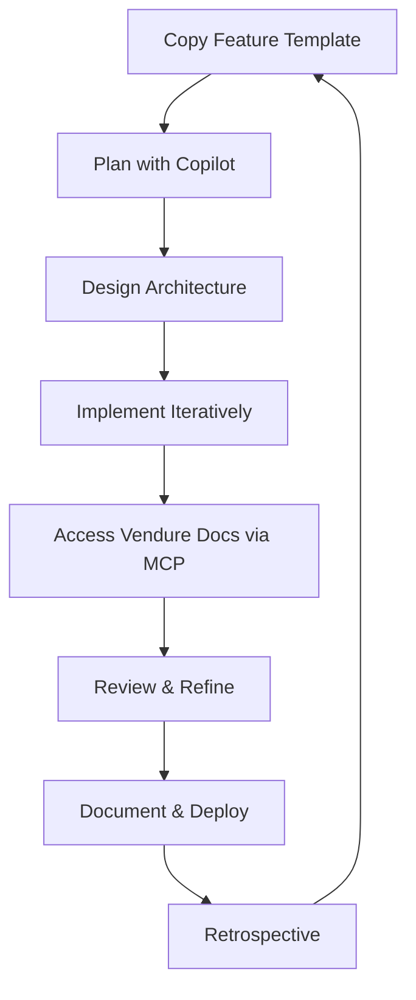

# Melinda Potondi - Vendure E-commerce Development Platform

A comprehensive development platform for building Vendure e-commerce solutions with integrated documentation access and AI-assisted feature planning.

## 🏗️ Project Structure

```
melindapotondi/
├── .github/                          # GitHub Copilot integration & planning
│   ├── FEATURE_PLANNING_TEMPLATE.md  # Interactive feature planning template
│   ├── COPILOT_PROMPTS.md           # Specialized Copilot prompts for Vendure
│   └── INTERACTIVE_WORKFLOW.md      # Collaborative development workflow
├── mcp-vendure/                     # MCP server for Vendure documentation
│   ├── src/index.ts                # Main MCP server implementation
│   ├── package.json                # MCP server dependencies
│   └── README.md                   # MCP server documentation
└── README.md                       # This file
```

## 🚀 Features

### 📖 MCP Vendure Documentation Server
- **Live Documentation Access**: Direct integration with docs.vendure.io/llm.txt
- **Smart Search**: Context-aware search through Vendure documentation
- **API Reference**: Quick access to GraphQL and TypeScript API references
- **Plugin Examples**: Curated examples for plugin development
- **Intelligent Caching**: Performance-optimized documentation retrieval

### 🎯 Interactive Feature Planning
- **Structured Planning Templates**: Comprehensive feature planning framework
- **GitHub Copilot Integration**: Specialized prompts for Vendure development
- **Interactive Workflow**: Collaborative development process with AI assistance
- **Best Practices**: Built-in software engineering and architectural guidance

## 🛠️ Setup Instructions

### 1. MCP Server Setup

```bash
# Install MCP server dependencies
cd mcp-vendure
npm install

# Build the server
npm run build

# Test the server
npm start
```

### 2. Configure MCP Client

Add to your MCP client configuration (e.g., Claude Desktop):

```json
{
  "mcpServers": {
    "vendure-docs": {
      "command": "node",
      "args": ["/path/to/melindapotondi/mcp-vendure/dist/index.js"],
      "env": {}
    }
  }
}
```

### 3. GitHub Copilot Integration

1. Copy `.github/FEATURE_PLANNING_TEMPLATE.md` for each new feature
2. Use prompts from `.github/COPILOT_PROMPTS.md` in your development
3. Follow the workflow in `.github/INTERACTIVE_WORKFLOW.md`

## 🎯 Getting Started with Feature Development

### Step 1: Plan Your Feature
```bash
# Copy the planning template
cp .github/FEATURE_PLANNING_TEMPLATE.md features/my-new-feature.md
```

### Step 2: Use GitHub Copilot for Planning
Open the feature planning document and start a conversation with Copilot:

```markdown
I need to plan a new Vendure feature for [DESCRIBE YOUR FEATURE].

Help me:
1. Define clear user stories
2. Identify technical requirements  
3. Suggest architecture approaches
4. Plan the implementation phases
```

### Step 3: Interactive Development
Follow the interactive workflow in `.github/INTERACTIVE_WORKFLOW.md` to:
- Collaborate with Copilot on design decisions
- Get code suggestions with proper context
- Iterate on implementation
- Review and optimize code

### Step 4: Access Vendure Documentation
Use the MCP server to get real-time access to Vendure documentation:
- Search for specific concepts
- Get API references
- Find plugin examples
- Access best practices

## 🔧 MCP Server Tools

The MCP server provides three main tools:

### `fetch_vendure_docs`
Search through Vendure's comprehensive documentation.
```json
{
  "query": "GraphQL mutations for orders",
  "section": "API Reference"
}
```

### `get_vendure_api_reference`
Get specific API references for GraphQL or TypeScript.
```json
{
  "apiType": "graphql",
  "entityName": "Order"
}
```

### `get_vendure_plugin_examples`
Find examples for plugin development.
```json
{
  "pluginType": "payment",
  "complexity": "intermediate"
}
```

## 📚 Documentation & Templates

### Feature Planning
- **Template**: `.github/FEATURE_PLANNING_TEMPLATE.md`
- **Purpose**: Comprehensive feature planning with architecture considerations
- **Usage**: Copy for each new feature, fill out collaboratively with Copilot

### Copilot Prompts
- **File**: `.github/COPILOT_PROMPTS.md`
- **Purpose**: Specialized prompts for Vendure development
- **Categories**: Services, Entities, Resolvers, Plugins, Testing, Documentation

### Interactive Workflow
- **File**: `.github/INTERACTIVE_WORKFLOW.md`
- **Purpose**: Step-by-step collaborative development process
- **Benefits**: Structured approach to AI-assisted development

## 🏆 Best Practices

### Architecture
- Follow Vendure plugin architecture patterns
- Use dependency injection properly
- Implement event-driven designs
- Consider performance and scalability

### Code Quality
- Use TypeScript strict mode
- Implement comprehensive error handling
- Write thorough tests
- Follow security best practices

### Development Process
- Plan features thoroughly before coding
- Use interactive development with Copilot
- Iterate on designs based on feedback
- Document architectural decisions

## 🤝 Contributing

1. **Plan First**: Use the feature planning template
2. **Collaborate**: Leverage GitHub Copilot for design and implementation
3. **Test**: Ensure comprehensive test coverage
4. **Document**: Update documentation for new features
5. **Review**: Use the interactive workflow for code reviews

## 📖 Additional Resources

- [Vendure Documentation](https://docs.vendure.io)
- [Vendure Plugin Development Guide](https://docs.vendure.io/guides/developer-guide/plugins/)
- [GraphQL API Reference](https://docs.vendure.io/reference/graphql-api/)
- [TypeScript API Reference](https://docs.vendure.io/reference/typescript-api/)

## 🔄 Workflow Summary



## 📞 Support

For questions about:
- **MCP Server**: Check `mcp-vendure/README.md`
- **Feature Planning**: Review `.github/INTERACTIVE_WORKFLOW.md`
- **Vendure Development**: Use the MCP server to access documentation
- **GitHub Copilot**: Reference `.github/COPILOT_PROMPTS.md`

---

**Happy Building with Vendure! 🚀**